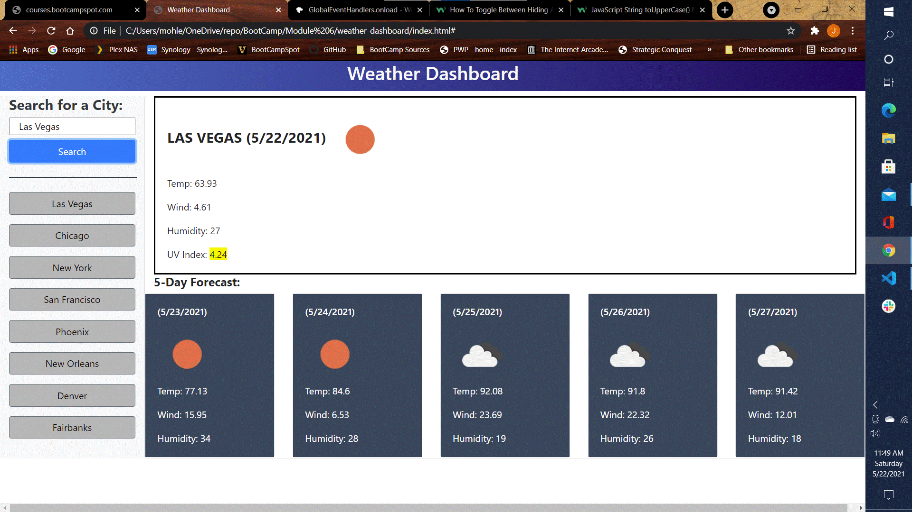

## Weather Dashboard

## John Mohlenkamp
## May 22, 2021

## GitHub Location: https://github.com/Mohlenkamp/weather-dashboard

## GitPages Location: https://mohlenkamp.github.io/weather-dashboard/index.html

## Description
### This is a weather dashboard that retrieves data from the OpenWeather API. It shows the current weather in the main column, and the aggregate 5-day forecast of the maximum temp/wind/humidity. The user can enter in a city using the manual search on the top left of the side navigation, or use one of the 8 previous search cities buttons underneath. 

